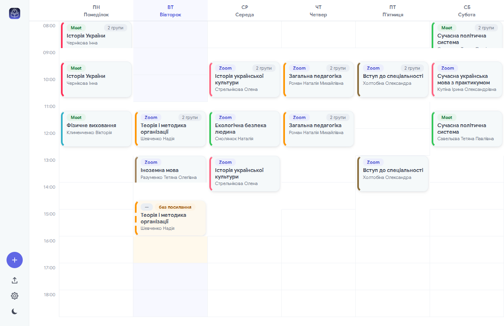

# AutoPara — автозапуск пар

A Windows tray app that imports a university timetable from a `.docx`, shows the week as a calendar
grid, and opens each class's Zoom / Google Meet link in the default browser a minute before it
starts. **The application's interface is Ukrainian**; this README and the design docs are English,
for whoever maintains it.

The interface takes its shape and spacing from Apple's Human Interface Guidelines as far as Qt
allows — squircle corners, hairlines instead of boxes, one tint used only where it means something
— over a palette of its own: `#6067e5` on white, or on `#0f1319` in the dark. The chrome is a 72 px
icon rail down the left rather than a toolbar across the top, because the week grid is wide and
short and a top bar spends the height a calendar is always short of.



## Install

Download **`AutoPara-Setup.exe`** from the latest release and run it. That is the whole procedure.

The target PC needs **nothing preinstalled** — no Python, no Qt, no VC++ redistributable; they are
all inside the installer. Windows 10/11 64-bit.

It installs per-user to `%LOCALAPPDATA%\Programs\AutoPara`, so there are **no admin rights and no
UAC prompt**. You get Start Menu and (optionally) desktop shortcuts, an entry in Add or Remove
Programs, and an optional "start with Windows" component that launches it hidden in the tray.

Silent install and uninstall are supported with `/S`. Uninstalling keeps your imported timetable in
`%APPDATA%\AutoPara` unless you choose to delete it, so reinstalling does not lose the schedule.

## Run from source

```
python -m pip install -r requirements.txt
python -m autopara
```

On first launch it opens on the import screen: **drag the `.docx` onto it** — anywhere on the
screen, not just the dashed well — or press `Обрати файл…`. Then pick your course and group.

`python -m autopara` also **refreshes the installed copy** from the source it is running out of, so
checking a change is one command rather than a reinstall. Add `--no-rebuild` to skip that.

## Build it yourself

```
python -m pip install pyinstaller     # once
winget install NSIS.NSIS              # once
.\build.cmd
```

| File | Size | What it is |
|---|---|---|
| `dist\AutoPara-1.4.0-Setup.exe` | 35.0 MB | NSIS installer — hand this to someone who does not have the repository. |
| `dist\AutoPara\` | 126 MB folder | The unpacked app, if you'd rather not install. |

`.\build.cmd -SkipApp` rebuilds only the installer from an existing `dist\AutoPara\`.

You do not have to build it to publish it: pushing to `main` runs the same `build.cmd` on a Windows
runner and attaches the installer to a GitHub release
([`.github/workflows/installer.yml`](.github/workflows/installer.yml)). The release is cut from
`APP_VERSION` in `installer/AutoPara.nsi`, and only when that version has no tag yet — so **bump
that number in the commit you want released.** A push that leaves it alone still builds, and the
installer is downloadable from the run's artifacts.

**Run `build.cmd`, not `build.ps1` directly.** Windows refuses to run `.ps1` files at all under its
default execution policy, so `.\build.ps1` fails with *UnauthorizedAccess* on any machine nobody
has configured. `build.cmd` lifts that for the single process it starts — it changes no setting,
for the machine or for you, and needs no administrator. (If you would rather allow scripts for your
own account once and for all, that is
`Set-ExecutionPolicy -Scope CurrentUser RemoteSigned` in an ordinary PowerShell window; it is a
security setting, so it is yours to make, not the build's.)

The build renders the app icon before it packages anything: `build\AutoPara.ico` is drawn from the
same code as the tray glyph, compiled into the executable — which is what every shortcut inherits —
and used for `Setup.exe` and the uninstaller too, so a downloaded installer is recognisable before
it has installed anything. Skipping that step (running PyInstaller or makensis by hand) is allowed:
both fall back to their stock icons.

## How it behaves

- **Opens each class once.** The lead time defaults to 1 minute and is configurable. Restarting the
  app, waking from sleep, or changing the clock cannot cause a second open — the guarantee is a
  database constraint, not in-memory state.
- **A missed class is never opened behind your back.** If a class was already running when AutoPara
  started, the window comes forward with a banner naming it and two buttons — *Підключитися зараз*
  and *Закрити*. Nothing opens until you pick one. This holds even when the catch-up setting says
  "open immediately": that setting applies to a class that starts while the app is running.
- **Reminders.** An optional tray notification a configurable number of minutes before each class.
- **Any-language documents.** Day names are recognised in Ukrainian, Russian, English, Polish,
  German and several other languages; the schedule the app builds from them is always Ukrainian.
- **Editable straight away** — no edit mode. **Left click joins the class**, which is the one thing
  the app exists for, so it costs one click. **Right click opens the actions menu** (open, edit,
  mark as opened or skipped, delete). Click an empty slot to create a class there, drag a class to
  move it. A class with no link offers to add one instead of opening.
- **A real calendar day**, 08:00 to 18:00 in hourly rows, with each class drawn across the time it
  actually occupies rather than dropped into a slot — a 09:30 class starts halfway down the 09:00
  row. Columns are weekdays; the timetable repeats every week, so there are no dates and nothing to
  navigate. The whole day fits the window without scrolling.
- **A card is as tall as its class is long,** so a long subject cannot always be shown in full. The
  card is told its height and drops whole lines in a fixed order — the time goes first, since its
  position on the grid already says it — and its tooltip carries the subject, the teacher, the
  exact times, every group and the link.
- **Light and dark themes**, following the Windows app theme until you pin one.
- **Shared classes.** One session taught to several groups is a single card tagged with the groups,
  and its link opens once.
- **Re-importing** a new document keeps the course and group you had selected and your manually
  added classes, and clears the old week's records — a new timetable starts on a clean grid. It
  also only applies from the moment you import it, so setting one up at the weekend does not mark
  that weekend as missed.
- **Your timetable is copied into the app**, so deleting the original `.docx` costs you nothing.
  Reinstalling keeps that copy; uninstalling removes it along with everything else.

Closing the window hides it to the tray; use the tray menu to quit.

## Third-party

The interface is set in **Google Sans**, bundled in `autopara/ui/fonts` under the SIL Open Font
License 1.1 — the licence ships beside the font files as `OFL.txt`. Nothing else is bundled: every
icon in the app is drawn in code, the app mark included, and so is the `.ico` Windows reads for the
executable and the desktop shortcut.

## Documentation

Read these before changing anything:

- [docs/ARCHITECTURE.md](docs/ARCHITECTURE.md) — stack, process model, data flow, scheduling, build.
- [docs/BACKEND.md](docs/BACKEND.md) — the `.docx` parsing rules, data model, scheduler.
- [docs/FRONTEND.md](docs/FRONTEND.md) — screens, widgets, styling.

## Tests

```
python -m pytest
```

240 tests, about 30 seconds. Parser tests run against the real schedule document, which is not
committed. Put it on the Desktop or set `AUTOPARA_TEST_DOCX` to its path; the tests skip if it
cannot be found — so check the count, not just the colour.
